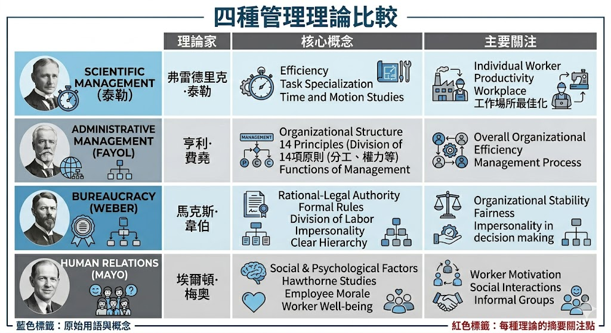
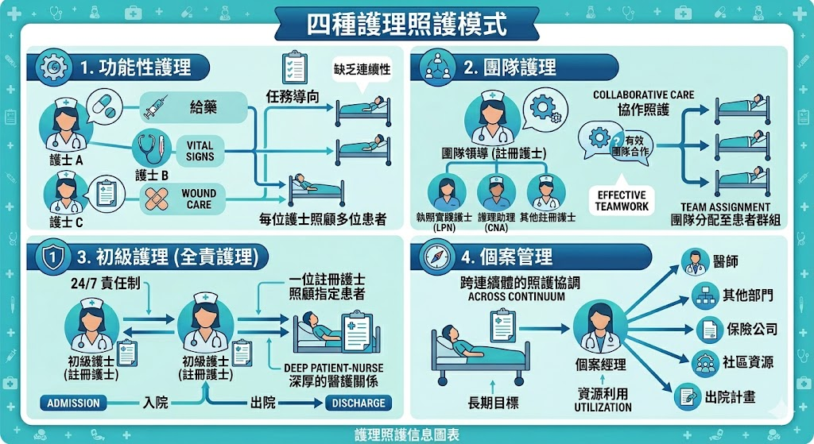
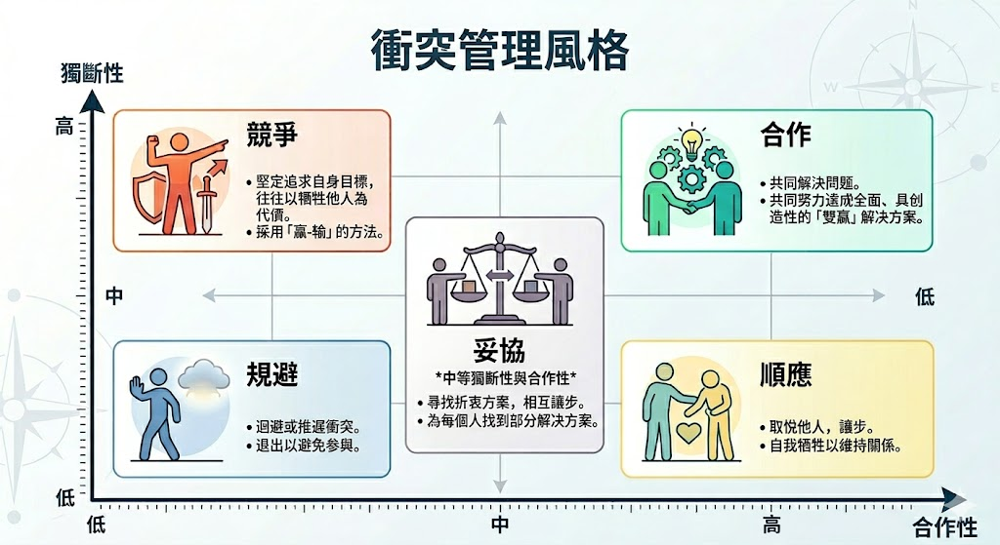
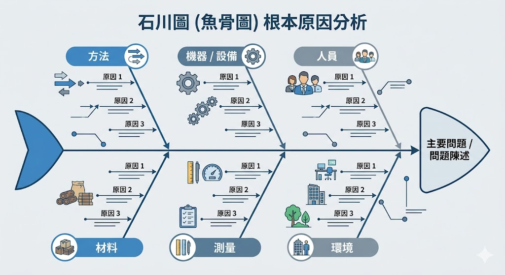

# 📖 護理師專技高考教材：第一科【護理行政】

**【考情分析】**
護理行政在國考中併入「基本護理學與護理行政」，通常佔約 10~15 題。近五年的命題趨勢極度偏重「情境題」，特別是**護理照護模式的應用**、**品質管理（RCA/HFMEA）**、**領導與衝突處理**、以及**護理時數計算**。

---

## 第一章：護理管理理論與發展

本章節考點集中於各管理學派的「核心精神」與「代表人物」的配對。

### 1.1 科學管理學派
* **代表人物：** 泰勒 (Frederick Taylor) —— 被尊為「科學管理之父」。
* **核心精神：** 運用「時間與動作研究」，尋找完成工作的「最佳方法」。
* **國考重點：** 強調效率、標準化作業流程、實施「論件計酬」以金錢激勵員工。

### 1.2 行政管理學派
* **代表人物：** 費堯 (Henri Fayol) —— 「管理程序之父」。
* **核心精神：** 提出管理的五大功能：**計畫 (Planning)、組織 (Organizing)、指揮 (Commanding)、協調 (Coordinating)、控制 (Controlling)**。
* **國考重點：** 強調組織整體的管理，提出 14 項管理原則（如：統一指揮、專業分工）。

### 1.3 科層體制（層級分析學派）
* **代表人物：** 韋伯 (Max Weber) —— 「組織理論之父」。
* **核心精神：** 建立嚴格的層級節制與法制化規範。
* **國考重點：** 強調「對事不對人」、公私分明、依據明文規章辦事、升遷依據年資與技術能力。

### 1.4 人群關係學派
* **代表人物：** 梅堯 (Elton Mayo)。
* **核心精神：** 著名的「霍桑實驗 (Hawthorne Studies)」。
* **國考重點：** 證實「社會心理因素」（如：被重視的感覺、非正式組織的同儕壓力）比實質工作條件（如：燈光、薪水）更能影響員工的生產力。

> 📌 **[TODO 1: 管理學派演進比較表]**
> * **說明：** 建立一個表格，比較科學管理、行政管理、科層體制與人群關係學派的代表人物與核心主張。
> * 

---

## 第二章：護理照護模式 (Nursing Care Delivery Models) 🌟

本章是情境題的熱門考區，必須熟練判斷各種照護模式的優缺點。

1. **功能性護理 (Functional Nursing)：**
   * **特色：** 以「工作任務」為導向分工（如：發藥護士、治療護士）。
   * **優缺點：** 效率高、節省人力；但病人缺乏整體性照護，護病溝通片段。
2. **全責護理 / 成組護理 (Team Nursing)：**
   * **特色：** 由一位小組長（通常是RN）帶領組員（RN、LPN或護生）共同照顧一組病人。
   * **關鍵：** 高度依賴小組長的「領導與溝通協調」能力，常需召開小組會議。
3. **初段護理 / 全人護理 (Primary Nursing)：**
   * **特色：** 一位護理師（Primary Nurse）對特定病人負責「24小時」的護理計畫，從入院到出院。下班時由協同護理師（Associate nurse）依其計畫執行。
   * **優缺點：** 護病關係最好、護理人員自主性最高；但成本最高，需要全數為註冊護理師（RN）。
4. **個案管理 (Case Management)：**
   * **特色：** 針對複雜、跨科別、高花費的個案。強調「跨領域團隊合作」與「臨床路徑 (Clinical Pathway)」，以控制成本並確保品質。

> 📌 **[TODO 2: 護理照護模式比較圖]**
> * **說明：** 將上述四種模式以圖解方式呈現護理人員與病人的對應關係（例如一對多、多對多、組長帶領等）。
> * 

---

## 第三章：領導與衝突管理

近年國考極度偏愛「轉換型領導」與「衝突處理模式」。

### 3.1 領導型態
* **交易型領導 (Transactional Leadership)：** 建立在「條件交換/獎懲」上，你做好就給獎勵，做錯就懲罰（維持現狀）。
* **轉換型領導 (Transformational Leadership)：** 🌟 (極高頻考點) 領導者透過「魅力、願景、個別關懷、心智啟發」，激發部屬潛能，超越個人利益為組織效力。

### 3.2 衝突管理策略 (Thomas-Kilmann 模式)
* **競爭 (Win-Lose)：** 高度堅持己見，不顧他人。緊急狀況或需要果斷決策時使用。
* **退避 / 逃避 (Lose-Lose)：** 不堅持也不合作。冷卻情緒時使用。
* **順應 (Lose-Win)：** 放棄己見滿足對方。維持和諧或發現自己錯誤時使用。
* **妥協 (No Win-No Lose)：** 各退一步，尋求雙方可接受的方案。雙方勢均力敵時使用。
* **合作 / 解決問題 (Win-Win)：** 🌟 (最佳策略) 高度堅持且高度合作，共同找出最佳解答。

> 📌 **[TODO 3: 衝突處理模式座標圖]**
> * **說明：** X軸為「合作性」(關心他人)，Y軸為「堅持性」(關心自己)，畫出五種衝突處理策略的落點。
> * 

---

## 第四章：護理品質管理與病人安全 🌟

這是目前臨床最重視的區塊，幾乎佔據護理行政一半的考題。

### 4.1 品質管理概念
* **品質保證 (QA) vs. 持續性品質改善 (CQI/TQM)：**
  * QA：事後檢查、抓出犯錯的「人」、達到最低標準即可。
  * CQI：重視「過程」與「系統」、預防重於治療、全員參與、追求卓越。

### 4.2 異常事件與分析工具
* **病人安全事件通報 (TPR)：** 匿名、自願性通報，絕對**不以懲罰為目的**。
* **根本原因分析 (RCA - Root Cause Analysis)：** 🌟
  * 屬於「事後」回溯性分析。當發生警訊事件（如開錯刀、給錯高警訊藥物）時啟動。
  * 尋找系統性原因，而非指責個人。常用工具：**魚骨圖（石川圖）**。
* **醫療照護失效模式與效應分析 (HFMEA)：**
  * 屬於「事前」前瞻性分析。在流程實施前，預先評估哪裡可能出錯並預防。

> 📌 **[TODO 4: RCA 魚骨圖 (Fishbone Diagram)]**
> * **說明：** 繪製品質管理常用的魚骨圖（特性要因圖），魚頭為「不良結果/問題」，魚骨分支為 4M1E。
> * 

---

## 第五章：排班與護理時數計算

* **病人分類系統 (Patient Classification System, PCS)：** 依據病人需要的「護理時數」與「依賴程度」進行分類，**而非依據疾病診斷**。這是決定護理人力最客觀的標準。
* **護理時數 (Nursing Hours Per Patient Day, NHPPD)：**
  * **公式：** `單位內護理人員總工作時數 ÷ 單位內病人總數`。
  * **考題常態：** 常給出護病比或各班別護理人員數，要求計算 NHPPD。
  * **計算範例：** 病房有 20 位病人。白班 3 人、小夜班 2 人、大夜班 2 人（每人工作 8 小時）。總工作時數為 (3+2+2) * 8 = 56 小時。NHPPD = 56 ÷ 20 = 2.8 小時/人。