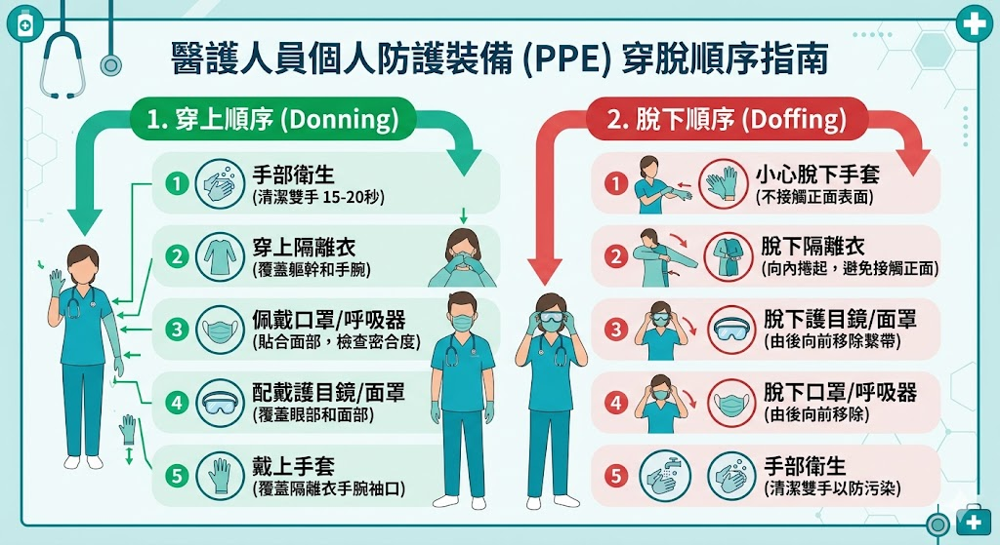
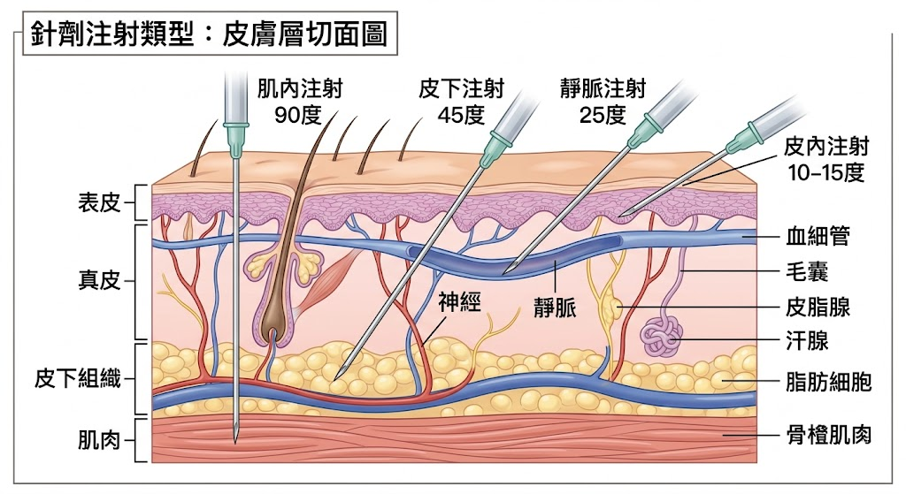

# 📖 護理師專技高考教材：第二科【護理學及護理技術】(基本護理學)

**【考情分析】**
基本護理學是所有臨床實務的基礎。近五年（108-112年）的考題高度集中於**感染控制（受疫情影響極大）、壓傷分期（NPUAP最新指引）、安全給藥（三讀五對、針頭尺寸選擇）與無菌技術（導尿、抽痰）**。情境題常測驗操作步驟的先後順序與錯誤辨識。

---

## 第一章：醫療環境與感染控制

本章節為絕對必考區，特別是隔離措施與防護裝備的穿脫順序。

### 1.1 醫療照護相關感染 (HAI) 與洗手
* **最常見的院內感染部位：** 泌尿道感染（通常與存留導尿管 CAUTI 有關）。
* **洗手五時機 (5 Moments for Hand Hygiene)：**
  1. 接觸病人**前**。
  2. 執行清潔/無菌操作技術**前**。
  3. 暴觸病人體液風險**後**。
  4. 接觸病人**後**。
  5. 接觸病人周遭環境**後**。
* **洗手方式選擇：** 若手部有明顯髒汙或接觸**困難梭狀桿菌 (C. difficile)**，**必須**使用濕洗手（肥皂與水），不可單用酒精性乾洗手。

### 1.2 隔離防護措施 (Isolation Precautions)
1. **標準防護措施 (Standard Precautions)：** 視所有病人的血液、體液、分泌物均具有傳染性。
2. **接觸傳染 (Contact)：** 如 VRE、MRSA、疥瘡。需穿戴隔離衣與手套。
3. **飛沫傳染 (Droplet)：** 如 流感、百日咳、流行性腦脊髓膜炎。病原體 > 5μm。需配戴**外科口罩**，距離病人1公尺內需防護。
4. **空氣傳染 (Airborne)：** 如 肺結核 (TB)、麻疹、水痘。病原體 < 5μm。病人須住**負壓隔離病房**，護理人員需配戴 **N95口罩**。

### 1.3 個人防護裝備 (PPE) 穿脫順序 🌟
* **穿戴順序 (由下而上，由內而外)：** 發帽 ➔ 口罩 ➔ 隔離衣 ➔ 護目鏡/面罩 ➔ 手套 (手套需蓋住隔離衣袖口)。
* **脫除順序 (污染最嚴重者先脫)：** 手套 ➔ 護目鏡/面罩 ➔ 隔離衣 ➔ 口罩 ➔ 發帽 ➔ 立即洗手。

> 📌 **[TODO 4: PPE 穿脫順序圖解]**
> * **說明：** 繪製兩組流程圖，左側為穿戴順序，右側為脫除順序。標示出「污染區」與「清潔區」的概念。
> 

---

## 第二章：生命徵象 (Vital Signs)

測量順序通常為：體溫 (T) ➔ 脈搏 (P) ➔ 呼吸 (R) ➔ 血壓 (BP) ➔ 疼痛評估 (Pain，被稱為第五生命徵象)。

### 2.1 體溫 (Temperature)
* **測量部位溫度高低：** 肛溫 > 耳溫 > 口溫 > 腋溫。
* **發燒的熱型：**
  * **恆熱 (Constant fever)：** 持續高燒，日夜溫差 < 1℃ (如：傷寒)。
  * **弛張熱 (Remittent fever)：** 溫差 > 1℃，但最低溫仍高於正常值 (如：敗血症)。
  * **間歇熱 (Intermittent fever)：** 體溫在正常與高燒之間交替 (如：瘧疾)。

### 2.2 脈搏 (Pulse) & 呼吸 (Respiration)
* **心尖脈 (Apical pulse)：** 聽診位置於**左側鎖骨中線與第五肋間交界處**。測量需聽滿一分鐘。使用毛地黃 (Digitalis) 藥物前必測，若成人心跳 < 60次/分需停藥。
* **庫斯毛耳氏呼吸 (Kussmaul's breathing)：** 呼吸深且快，常見於**糖尿病酮酸中毒 (DKA)**。
* **陳施氏呼吸 (Cheyne-Stokes breathing)：** 呼吸由淺慢逐漸變深快，再變淺慢，接著出現呼吸暫停的週期循環。常見於瀕死、腦部嚴重損傷病人。

### 2.3 血壓 (Blood Pressure)
* **壓差 (Pulse pressure)：** 收縮壓減去舒張壓，正常為 30~50 mmHg。
* **測量誤差常考點：**
  * 壓脈帶**太窄**或**太鬆**：測量值假性**偏高**。
  * 壓脈帶**太寬**：測量值假性**偏低**。
  * 手臂位置**高於**心臟：測量值假性**偏低**。

---

## 第三章：給藥法與靜脈輸液

安全給藥是絕對護理核心，每年必考計算與常規。

### 3.1 安全給藥原則
* **三讀：** 從藥櫃取出藥物時、從容器取出藥物時、將藥物放回藥櫃或丟棄時。
* **五對：** 病人對、藥物對、劑量對、時間對、途徑對 (Right Patient, Drug, Dose, Time, Route)。

### 3.2 給藥途徑與吸收速率
* **吸收速度：** 靜脈注射 (IV) > 吸入 (Inhalation) > 舌下 (SL) > 肌肉注射 (IM) > 皮下注射 (SC) > 口服 (PO)。
* **針頭型號 (Gauge, G)：** G數越大，針頭越細。
  * 抽血/靜脈注射：一般用 20G ~ 22G。
  * 輸血：需較粗針頭避免溶血，常用 18G ~ 20G。
  * 皮下注射 (如胰島素)：常用 25G ~ 27G。

### 3.3 常見注射法角度與部位
* **皮內注射 (ID)：** 10~15度。常用於藥物過敏試驗或結核菌素測驗 (PPD)。注射後**不可揉**。
* **皮下注射 (SC)：** 45~90度 (視脂肪厚度)。常用於胰島素、肝素。打肝素**不可揉**以免出血。
* **肌肉注射 (IM)：** 90度。部位包含三角肌、臀大肌、臀中肌 (最安全，避開坐骨神經)、股外側肌 (嬰幼兒首選)。注射前**必須反抽**確認無回血。

> 📌 **[TODO 5: 各種注射途徑與皮膚層級剖面圖]**
> * **說明：** 繪製皮膚層剖面圖（表皮、真皮、皮下組織、肌肉），標示 ID, SC, IM, IV 的入針角度。
> 

---

## 第四章：皮膚與傷口護理

本章重點在於 NPUAP（美國國家壓傷諮詢委員會）的壓傷分期，是圖表題的最愛。

### 4.1 壓傷分期 (Pressure Injury Staging) 🌟 
* **第一期 (Stage 1)：** 皮膚**完整**，局部出現指壓**不會變白**的紅斑 (Non-blanchable erythema)。
* **第二期 (Stage 2)：** 部分皮層缺損，呈現表淺開放性潰瘍，底部呈粉紅色，**無腐肉**；或表現為完整/破裂的**水泡**。
* **第三期 (Stage 3)：** 全皮層缺損，可見**皮下脂肪**，但尚未暴露骨骼、肌腱或肌肉。可能有潛行或隧道形成。
* **第四期 (Stage 4)：** 全皮層與組織缺損，**暴露**出骨頭、肌腱或肌肉。常有腐肉或焦痂。
* **深部組織損傷 (DTI)：** 皮膚完整，但呈現**紫色或黯紅色**的局部變色區，或充血的水泡。代表皮下軟組織受損。
* **無法分期 (Unstageable)：** 全皮層缺損，但傷口底部被**腐肉或焦痂**完全覆蓋，無法評估真實深度。需清創後才能分期。

---

## 第五章：排泄護理 (排尿與排便)

### 5.1 導尿技術 (Catheterization)
* 屬**絕對無菌技術**。
* **尿道長度差異：** 女性約 4~5 公分；男性約 18~20 公分。
* **插入深度：** 女性見尿液流出後再推進 2~3 公分；男性見尿液流出後再推進 2.5~5 公分（確保水球在膀胱內，充氣時才不會撐破尿道）。
* **護理重點：** 尿袋應**低於**膀胱位置（避免逆行性感染），且不可觸及地面。

### 5.2 灌腸技術 (Enema)
* **姿勢：** 病人採**左側臥式**（Sims' position），使溶液順著重力流入乙狀結腸與降結腸。
* **高度：** 灌腸筒液面距離肛門口約 **30~45 公分**（太高流速過快會造成腸痙攣）。
* **水溫：** 約 37.7~40.5℃（接近體溫，過冷易引起痙攣）。
* **過程處置：** 若病人感到劇烈腹痛，應先**降低灌腸筒高度或夾住管子暫停流動**，並請病人深呼吸，切勿直接拔除。