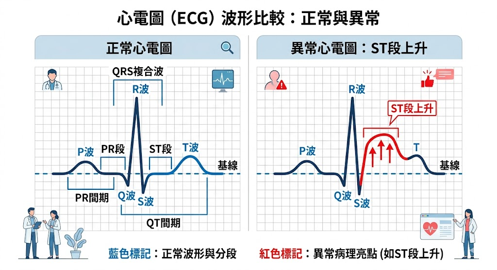
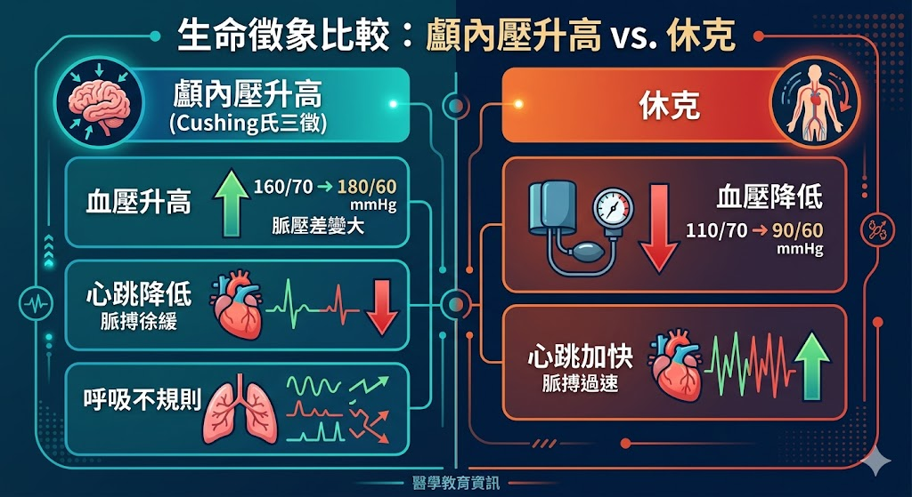

# 📖 護理師專技高考教材：第三科【內外科護理學】

**【考情分析】**
內外科護理學是國考的「考科三」，單獨佔據 80 題，是範圍最廣、最具鑑別度的一科。近五年（108-112年）命題極度強調「跨系統整合」、「急重症異常數據判讀（如 ABG、心電圖）」以及「術後併發症與擺位」。

以下為您萃取五大高頻必考系統的精要重點。

---

## 第一章：呼吸系統疾患與護理

本系統必考「動脈血液氣體分析 (ABG)」判讀與「胸腔引流管」照護。

### 1.1 動脈血液氣體分析 (ABG) 判讀
* **正常值記憶：** 
  * pH：7.35 ~ 7.45
  * PaCO2 (呼吸指標)：35 ~ 45 mmHg
  * HCO3- (代謝指標)：22 ~ 26 mEq/L
* **判讀口訣 (ROME)：**
  * **R**espiratory **O**pposite (呼吸性：pH與PaCO2呈**反向**變動)。
  * **M**etabolic **E**qual (代謝性：pH與HCO3-呈**同向**變動)。
* **常見情境：**
  * **呼吸性酸中毒：** 換氣不足（如 COPD、氣喘、鎮靜劑過量）。
  * **呼吸性鹼中毒：** 過度換氣（如 焦慮、高山症、疼痛）。

### 1.2 慢性阻塞性肺疾病 (COPD)
* **包含兩種疾病：** 慢性支氣管炎（藍色多痰者 Blue bloater）與肺氣腫（粉紅氣喘者 Pink puffer）。
* **重要特徵：** 肺部呈現「桶狀胸 (Barrel chest)」，叩診呈過度迴響音。
* **護理指導：**
  * **呼吸法：** 教導「噘脂呼吸 (Pursed-lip breathing)」以延長呼氣時間，防止小呼吸道提早塌陷，促進 CO2 排出。
  * **給氧原則：** **低濃度給氧** (1~2 L/min 或 FiO2 24~28%)。若給予高濃度氧氣，會抑制患者靠低血氧驅動的呼吸驅力，導致呼吸停止。

### 1.3 胸腔引流管照護 (Chest Tube)
* **水下密封瓶原理：** 保持胸膜腔的負壓。
* **觀察重點：** 
  * 正常情況下，水合柱會隨呼吸「上下起伏 (Tidaling)」。
  * 若水合柱停止起伏，可能代表肺已擴張，或管路阻塞/扭曲。
  * 若水下密封瓶出現「持續不斷的氣泡」，代表系統有**漏氣**（需立刻檢查管路連接口）。
* **意外處理：** 若引流管不慎從胸壁滑脫，護理師應**立即以凡士林紗布（或無菌敷料）於呼氣末期封住傷口**，避免引發張力性氣胸。

---

## 第二章：心血管系統疾患與護理

重點落在「心肌梗塞 (MI)」的處置與「左右心衰竭」的症狀對比。

### 2.1 冠狀動脈疾病與心肌梗塞 (Acute Myocardial Infarction, AMI)
* **典型症狀：** 劇烈胸痛，且**無法**透過休息或含服舌下硝酸甘油 (NTG) 緩解。疼痛常輻射至左肩、左臂內側、下頷。
* **心電圖 (ECG) 變化：** 
  * 缺血：T波倒置。
  * 損傷：ST段上升 (STEMI，極危急)。
  * 壞死：出現異常 Q波（寬度>0.04秒，深度>1/4 R波）。
* **急性期處置口訣 (MONA)：**
  * **M**orphine (嗎啡)：止痛並降低心臟耗氧。
  * **O**xygen (氧氣)：改善組織缺氧。
  * **N**TG (硝酸甘油)：擴張冠狀動脈。
  * **A**spirin (阿斯匹靈)：抗血小板凝集，防血栓擴大。

### 2.2 心臟衰竭 (Heart Failure) 🌟
國考極愛考左心與右心衰竭的症狀區別：
* **左心衰竭 (肺部症狀為主)：** 左心室無力，血液回堵至肺臟。
  * 症狀：肺水腫、端坐呼吸、陣發性夜間呼吸困難 (PND)、咳出**粉紅色泡沫痰**。
* **右心衰竭 (全身症狀為主)：** 右心室無力，血液回堵至全身靜脈。
  * 症狀：頸靜脈怒張 (JVE)、周邊凹陷性水腫、肝脾腫大、腹水、體重增加。

> 📌 **[TODO 6: 正常心電圖波形與心肌梗塞變化]**
> * **說明：** 繪製正常 ECG (PQRST波)，並在旁邊對比繪製 ST段上升 (ST elevation) 與異常 Q波的圖示。
> 

---

## 第三章：神經系統疾患與護理

核心考點為「顱內壓升高 (IICP)」的觀察與「格拉斯哥昏迷量表 (GCS)」。

### 3.1 意識評估：格拉斯哥昏迷量表 (GCS)
總分 15 分，最低 3 分（沒有 0 分）。
* **E (眼睛睜開, 4分)：** 4.自然睜眼 3.呼喚睜眼 2.疼痛刺激睜眼 1.無反應。
* **V (語言反應, 5分)：** 5.定向力佳 4.混亂 3.不適當的字詞 (Inappropriate words) 2.發出無法理解的聲音 1.無反應。*(若插管無法發聲記為 E, 氣切記為 T)*。
* **M (運動反應, 6分)：** 6.聽從命令 5.能指出疼痛部位 (Localize) 4.對痛有回縮反應 (Withdraw) 3.異常屈曲 (去皮質姿勢, Decorticate) 2.異常伸展 (去大腦姿勢, Decerebrate) 1.無反應。

### 3.2 顱內壓升高 (Increased Intracranial Pressure, IICP)
* **正常顱內壓：** 5 ~ 15 mmHg。大於 20 mmHg 需立即處理。
* **早期症狀：** **意識改變** (最敏感的指標)、頭痛、嘔吐 (常為噴射狀嘔吐)。
* **晚期致命症狀 - 庫欣氏三病徵 (Cushing's triad)：** 代表腦幹受壓迫，即將腦疝脫。
  1. **收縮壓升高** (且脈搏壓變寬)。
  2. **心跳變慢**。
  3. **呼吸不規則**。
* **護理措施：** 床頭抬高 30度 (促進靜脈回流)、頭部保持正中、**避免**髖關節過度屈曲、**禁止**等長運動 (如用力排便 Valsalva maneuver)。

> 📌 **[TODO 7: 庫欣氏三病徵 (Cushing's Triad) vs 休克 (Shock)]**
> * **說明：** 國考常將 IICP 的生命徵象與休克對比。休克是「血壓↓、心跳↑」；IICP 是「血壓↑、心跳↓」。可做成對比圖。
> 

---

## 第四章：消化系統疾患與護理

### 4.1 消化性潰瘍 (Peptic Ulcer Disease, PUD)
絕大多數與 **幽門螺旋桿菌 (H. pylori)** 感染有關。
* **胃潰瘍 (GU)：** 
  * 痛感：進食後 30~60 分鐘疼痛。**進食會加重疼痛**。
  * 症狀：體重減輕，易發生「吐血」。
* **十二指腸潰瘍 (DU)：** (較常見)
  * 痛感：進食後 2~3 小時（空腹時）疼痛。半夜常痛醒。**進食可緩解疼痛**。
  * 症狀：體重增加，易發生「黑便/柏油便 (Melena)」。

### 4.2 肝硬化 (Liver Cirrhosis) 與併發症
* **食道靜脈曲張破裂出血：** 最致命。處置包含放置 Sengstaken-Blakemore (S-B) tube 壓迫止血，護理重點為床頭放置剪刀（若氣球滑脫阻塞呼吸道需立即剪斷管子放氣）。
* **肝性腦病變 (Hepatic Encephalopathy)：**
  * 原因：肝臟無法將氨 (Ammonia, NH3) 轉化為尿素，導致血氨升高毒害腦部。
  * 症狀：撲擊性震顫 (Flapping tremor / Asterixis)、意識混亂、肝僵直。
  * 處置：**限制蛋白質攝取**、給予乳果糖 (Lactulose) 促進排便以降低腸道吸收氨、給予新黴素 (Neomycin) 殺死腸道產氨細菌。

---

## 第五章：內分泌系統疾患與護理

### 5.1 糖尿病 (Diabetes Mellitus, DM) 急性併發症
* **低血糖 (Hypoglycemia)：** 最危急！症狀為冷汗、發抖、心悸、意識改變。處置口訣「清醒給糖水，昏迷給 IV D50W 或升糖素」。
* **糖尿病酮酸中毒 (DKA)：** 常見於第 1 型 DM。
  * 症狀：血糖 > 300 mg/dL、尿酮強陽性、**庫斯毛耳氏呼吸 (Kussmaul's respirations)**、呼氣有水果味/丙酮味。
* **高滲透壓高血糖狀態 (HHS)：** 常見於第 2 型 DM 老年人。
  * 症狀：血糖極高 (常 > 600 mg/dL)、嚴重脫水、**無酮體**或微量。
  * **DKA 與 HHS 的首要醫療處置皆為：立即大量補充生理食鹽水 (0.9% NaCl)** 以恢復血容積，隨後給予常規胰島素 (RI)。