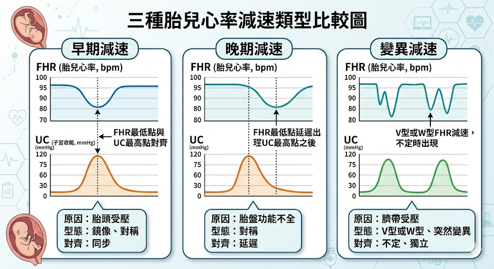
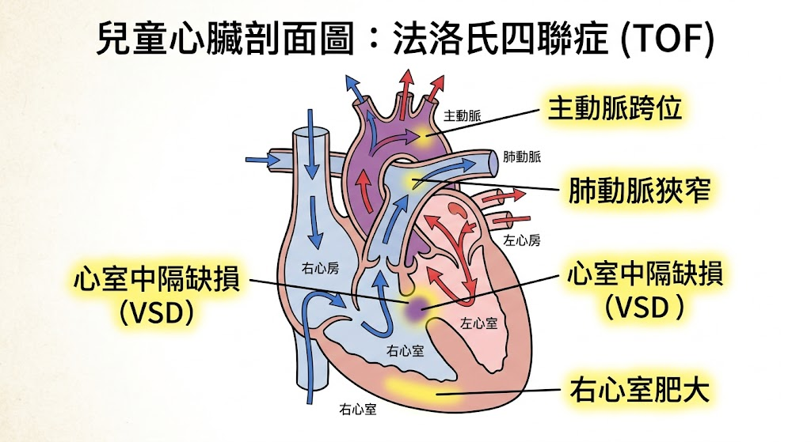

# 📖 護理師專技高考教材：第四科【產兒科護理學】

**【考情分析】**
產兒科護理學合併為國考的「考科四」，共 80 題（產科與兒科各約佔 40 題）。
* **產科（婦產科護理）：** 近年極度強調「產程進展的評估」、「胎心音減速的判讀（極高頻）」以及「產後大出血與急救」。
* **兒科（小兒科護理）：** 必考兒童各階段的「生長發育里程碑」、「先天性心臟病分類」以及「傳染性疾病與預防接種時程」。

---

## 🤰 第一部分：產科護理學 (Maternity Nursing)

### 第一章：妊娠期評估與計算
* **孕產史記錄 (GTPAL 系統)：** 🌟 (必考計算題)
  * **G (Gravida, 孕次)：** 懷孕的總次數（包含本次懷孕、流產、多胞胎算一次）。
  * **T (Term, 足月產)：** 懷孕滿 37 週（含）以上分娩的次數。
  * **P (Preterm, 早產)：** 懷孕滿 20 週但未滿 37 週分娩的次數。
  * **A (Abortion, 流產)：** 懷孕未滿 20 週即終止妊娠的次數。
  * **L (Living, 存活)：** 目前存活的孩子總數（多胞胎如雙胞胎算兩個）。
* **預產期計算 (Naegele's rule)：** 
  * 公式：最後一次月經的第一天 (LMP) + 7天，月份 - 3 (或 + 9)。
  * 考題常陷阱：若該年為閏年且跨越 2 月底，需注意天數變化。

### 第二章：分娩期護理 (Labor and Delivery)
產程分為四期，必須熟記各期的定義與護理重點。
* **第一產程 (規則陣痛到子宮頸全開 10 cm)：**
  * 分為潛伏期 (0-3 cm)、活動期 (4-7 cm)、過渡期 (8-10 cm)。
  * 護理重點：鼓勵產婦在潛伏期走動以促進產程；過渡期產婦會出現噁心、煩躁，需指導呼吸技巧（避免過早用力）。
* **第二產程 (子宮頸全開到胎兒娩出)：**
  * 護理重點：指導產婦配合宮縮閉氣用力 (Valsalva maneuver)；看見胎頭時（撥水 crowning），準備接生。
* **第三產程 (胎兒娩出到胎盤娩出)：**
  * 通常在胎兒娩出後 5~30 分鐘內完成。
  * 胎盤剝離徵象：子宮變圓變硬、陰道突然流出一股鮮血、臍帶向外延長。
* **第四產程 (胎盤娩出後 1 到 4 小時)：**
  * 護理重點：產後大出血的高危險期！需每 15 分鐘測量生命徵象並評估子宮收縮（Fundus）與惡露量。

### 第三章：胎心音與子宮收縮監測 🌟 (年年必考圖形題)
判讀胎心率 (FHR) 與子宮收縮的相對關係，口訣為 **VEAL CHOP**：
* **早期減速 (Early deceleration)：** 
  * 原因：胎頭受壓迫 (Head compression)。
  * 處置：屬於正常生理現象，不需特殊處理，繼續觀察。
* **晚期減速 (Late deceleration)：** 🌟 (最危險)
  * 原因：子宮胎盤血液灌流不足 (Placental insufficiency)。
  * 處置：立即停止催產素 (Oxytocin)、產婦改**左側臥**、給予高濃度氧氣、增加靜脈輸液。
* **變異性減速 (Variable deceleration)：**
  * 原因：臍帶受壓迫 (Cord compression)。
  * 處置：改變產婦姿勢（膝胸臥式或側臥）、給氧。

> 📌 **[TODO 8: 胎心音減速波形比較圖]**
> * **說明：** 繪製三組上下對應的折線圖，上方為胎心率 (FHR)，下方為子宮收縮 (UC)。呈現早期減速（波谷對齊波峰）、晚期減速（波谷晚於波峰）、變異性減速（呈V型、U型且與宮縮無關）。
> 

---

## 👶 第二部分：兒科護理學 (Pediatric Nursing)

### 第四章：兒童生長與發育里程碑 (Milestones)
國考極愛考粗動作與精細動作的發展時間點，必須背誦。
* **體重：** 出生約 3kg；5個月時變 2 倍；1歲時變 3 倍。
* **粗動作：**
  * 4 個月：頭部可穩定抬起，頸部不再搖晃。
  * 6 個月：會翻身。
  * 8 個月：不用扶也能坐得穩。
  * 9-10 個月：會爬行。
  * 12 個月：能扶著家具走。
  * 15 個月：能自己走路。
* **囟門閉合：** 
  * 後囟門：呈三角形，出生後 2~3 個月閉合。
  * 前囟門：呈菱形，出生後 12~18 個月閉合。前囟門凹陷代表脫水；膨出代表腦壓升高 (IICP)。

### 第五章：先天性心臟病 (Congenital Heart Disease, CHD)
重點在區分「發紺型」與「非發紺型」，以及血液分流方向。
* **非發紺型 (左向右分流 L ➔ R)：** 含氧血流回缺氧血，肺血流量增加。
  * 心室中膈缺損 (VSD)：最常見。
  * 心房中膈缺損 (ASD)。
  * 開放性動脈導管 (PDA)：治療可給予 Indomethacin 促進導管關閉。
* **發紺型 (右向左分流 R ➔ L)：** 缺氧血流到動脈，全身缺氧。
  * **法洛氏四重症 (Tetralogy of Fallot, TOF)：** 🌟 (國考最愛)
    * 四大特徵：心室中膈缺損 (VSD)、肺動脈狹窄 (PS)、主動脈跨位 (Overriding aorta)、右心室肥大 (RVH)。
    * 臨床特徵：缺氧發作 (Cyanotic spells) 時，病童會自然採取**蹲踞姿勢 (Squatting)** 以增加體循環阻力，減少右向左分流，改善肺部血流。
    * 護理處置：發作時立刻協助病童採取**膝胸臥式 (Knee-chest position)**。

> 📌 **[TODO 9: 法洛氏四重症 (TOF) 解剖示意圖]**
> * **說明：** 繪製兒童心臟的解剖切面圖，標示出 TOF 的四大病理特徵，並用箭頭畫出右心室的缺氧血混入左心室進入主動脈的方向。
> 

### 第六章：兒童常見傳染病與特殊疾患
* **川崎氏症 (Kawasaki Disease)：**
  * 全身性血管炎，好發於 5 歲以下兒童。最嚴重併發症為**冠狀動脈瘤**。
  * 臨床特徵：高燒 > 5天、草莓舌、結膜充血（無分泌物）、頸部淋巴結腫大、手掌腳底紅腫與脫皮、多型性紅斑。
  * 治療：**大劑量靜脈注射免疫球蛋白 (IVIG)** 加上 **高劑量阿斯匹靈 (Aspirin)** 🌟。*(注意：一般兒童發燒禁用阿斯匹靈以防雷氏症候群，但川崎氏症是少數的例外！這點非常愛考。)*
* **玫瑰疹 (Roseola infantum)：**
  * 特徵：**高燒 3~4 天後，退燒時才出疹**（熱退疹出）。疹子通常從軀幹開始蔓延，不癢。
* **腸病毒 (Enterovirus)：**
  * 疱疹性咽峽炎：口腔後部出現水泡與潰瘍。
  * 手足口病：手掌、腳底、口腔出現水泡。
  * 護理指導：給予**冰涼、軟質**的食物（如布丁、冰淇淋）以減輕吞嚥疼痛。