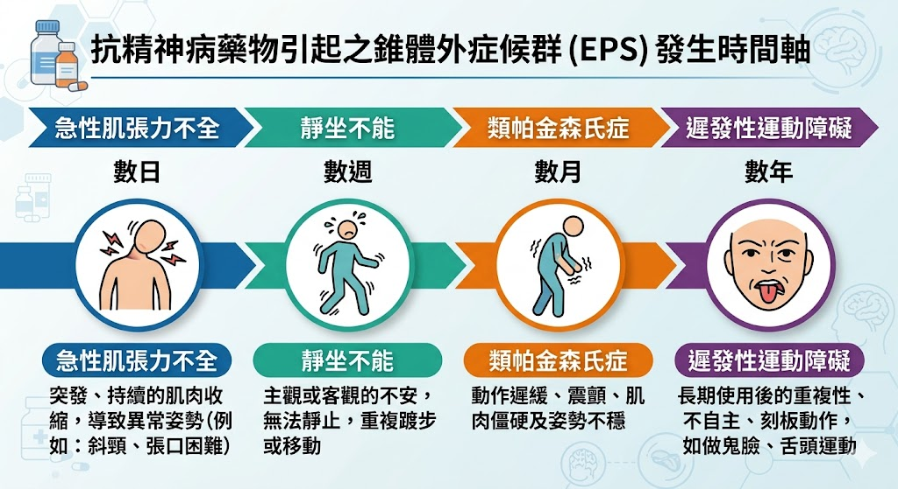
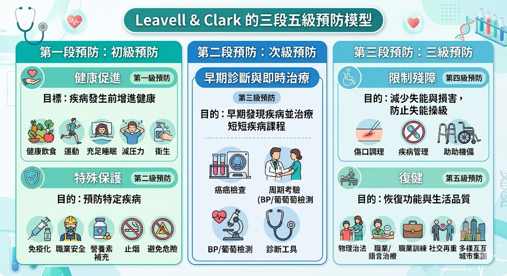

# 📖 護理師專技高考教材：第五科【精神與社區衛生護理學】

**【考情分析】**
考科五由「精神科護理」與「社區衛生護理」組成，各佔約 40 題。
* **精神科護理：** 考題極度重視「治療性人際關係與溝通技巧」、「防衛機轉的辨識」、「思覺失調症與抗精神病藥物副作用 (EPS)」。
* **社區衛生護理：** 絕對必考「三段五級預防概念（年年考）」、「流行病學計算」、「長照 2.0 政策與資源分配」及「家庭評估工具」。

---

## 🧠 第一部分：精神科護理學 (Psychiatric Nursing)

### 第一章：治療性溝通與防衛機轉
這是精神科最基礎也最愛考情境題的單元。

* **治療性溝通技巧：**
  * **傾聽 (Listening)：** 最基本且最重要的技巧。
  * **接納 (Acceptance)：** 不帶批判地接受病人的感受（但不代表同意其不當行為）。
  * **反映 (Reflection)：** 將病人的感受、想法或問題重新陳述，協助其自我覺察。
  * **面質 (Confrontation)：** 溫和地指出病人言行不一或矛盾之處（需在建立良好護病關係後才使用）。
* **常見自我防衛機轉 (Defense Mechanisms)：** 🌟 (情境辨識題)
  * **否認 (Denial)：** 拒絕接受痛苦的現實（如：得知罹癌卻認為是醫院檢查報告拿錯了）。
  * **投射 (Projection)：** 將自己不被接受的念頭歸咎於他人（如：自己想作弊，卻說別人都愛作弊）。
  * **合理化 (Rationalization)：** 用酸葡萄或甜檸檬心理，為失敗找藉口（如：考不好是因為題目出太偏）。
  * **轉移 (Displacement)：** 將對強者的憤怒轉發洩在弱者身上（如：被老闆罵，回家踢狗）。
  * **昇華 (Sublimation)：** (最成熟的機轉) 將社會不允許的衝動，轉化為有建設性的行為（如：有暴力傾向的人去當拳擊手）。

### 第二章：思覺失調症 (Schizophrenia)
* **正性症狀 (Positive symptoms)：** 現實中不該有卻多出來的。
  * **幻覺 (Hallucinations)：** 最常見為「聽幻覺」。*(護理：不要跟病人爭辯聲音的真假，但要表達你沒有聽到，並評估聲音是否為「命令性聽幻覺」，以防病人自傷或傷人)*。
  * **妄想 (Delusions)：** 堅信不疑的錯誤信念（如：被害妄想、關係妄想）。
* **負性症狀 (Negative symptoms)：** 正常人該有卻消失的。
  * 情感平淡 (Flat affect)、言語貧乏 (Alogia)、缺乏動機 (Avolition)、社交退縮。

### 第三章：抗精神病藥物與副作用
第一代抗精神病藥物（如 Haloperidol）極易產生**錐體外徑症候群 (EPS)**，是國考必考重點：
1. **急性肌張力不全 (Acute Dystonia)：** 服藥後幾天內發生，眼球上吊、斜頸、角弓反張。（最緊急，需立即給予抗膽鹼藥物如 Biperiden 緩解）。
2. **靜坐不能 (Akathisia)：** 煩躁不安、無法靜坐、不斷走動。
3. **假性巴金森氏症 (Pseudoparkinsonism)：** 面具臉、齒輪狀僵硬、小碎步。
4. **遲發性運動不能 (Tardive Dyskinesia, TD)：** 長期服藥後出現，常表現為不自主的噘嘴、吐舌、咀嚼動作。（停藥不一定會恢復，預防勝於治療）。

> 📌 **[TODO 10: 錐體外徑症候群 (EPS) 發生時間軸與特徵圖]**
> * **說明：** 繪製一條時間軸，標示 EPS 四大症狀的發生順序：急性肌張力不全 (幾天內) ➔ 靜坐不能/假性巴金森氏症 (幾週至幾個月) ➔ 遲發性運動不能 (數月至數年)。並附上簡單的特徵圖標（如上吊的眼睛代表 Dystonia，噘嘴代表 TD）。
> 

---

## 🏡 第二部分：社區衛生護理學 (Community Health Nursing)

### 第四章：流行病學與三段五級預防 🌟 (絕對必考)
Leavell & Clark 提出的「三段五級預防」是社區護理的骨幹。考題常給出一個行為（如：大腸癌篩檢），要你判斷屬於哪一級。

* **初段預防 (發病前 - 健康促進與特殊保護)：**
  * **第一級：健康促進。** (如：衛生教育、均衡營養、婚前健康檢查、優生保健)。
  * **第二級：特殊保護。** (如：**施打預防針/疫苗**、配戴安全帽、戴口罩、給水加氟)。
* **次段預防 (發病早期 - 早期診斷與適當治療)：**
  * **第三級：早期發現，早期治療。** (如：**各種癌症篩檢**、子宮頸抹片檢查、新生兒先天性代謝異常篩檢、胸部X光巡迴車)。
* **末段預防 (發病後期 - 限制殘障與復健)：**
  * **第四級：限制殘障。** (如：中風後馬上進行關節活動預防攣縮、糖尿病控制血糖以防截肢)。
  * **第五級：復健。** (如：職能治療、安裝義肢、庇護工場、身心障礙者就業輔導)。

> 📌 **[TODO 11: 三段五級預防階梯圖]**
> * **說明：** 繪製階梯圖或表格，清楚對應初段(1,2級)、次段(3級)、末段(4,5級)，並列出關鍵字（第一級健康促進、第二級特殊保護、第三級早期篩檢、第四級限制殘障、第五級復健）。
> 

### 第五章：家庭評估工具
護理師進入社區訪視時，常用的視覺化評估工具：
* **家族譜 (Genogram)：** 
  * 至少涵蓋 **三代**。
  * 呈現家庭成員的血緣、婚姻關係與重大遺傳疾病史。
  * 符號常識：正方形=男性，圓形=女性；打叉=死亡；虛線=同居；雙斜線=離婚。
* **家庭生態圖 (Ecomap)：** 
  * 呈現家庭與「外部社區系統（如學校、教會、醫療機構）」的互動關係與資源網絡。線條粗細代表關係的強弱（實線強、虛線弱、波浪線代表衝突）。
* **家庭功能評估 (Family APGAR)：**
  * 評估家庭在適應度 (Adaptation)、伴同度 (Partnership)、成長度 (Growth)、情感度 (Affection)、融洽度 (Resolve) 五個面向的功能。

### 第六章：長期照顧與傳染病防治
* **長照 2.0 (ABC 體系)：**
  * **A 級 (社區整合型服務中心)：** 「旗艦店」，負責擬定照顧計畫 (長照專員/個管師)。
  * **B 級 (複合型服務中心)：** 「專賣店」，提供居家服務、日間照顧、物理/職能治療。
  * **C 級 (巷弄長照站)：** 「柑仔店」，提供共餐、健康促進、延緩失能活動。
* **傳染病防治：**
  * **登革熱 (Dengue Fever)：** 病媒蚊為埃及斑蚊與白線斑蚊。主要社區防治策略為「巡、倒、清、刷」清除積水容器。
  * **結核病 (Tuberculosis, TB)：** 飛沫空氣傳染。核心治療策略為 **都治計畫 (DOTS, 短程直接觀察治療)**，強調「送藥到手、服藥入口、吞下再走」，以確保病人完成 6~9 個月的療程，避免產生抗藥性。