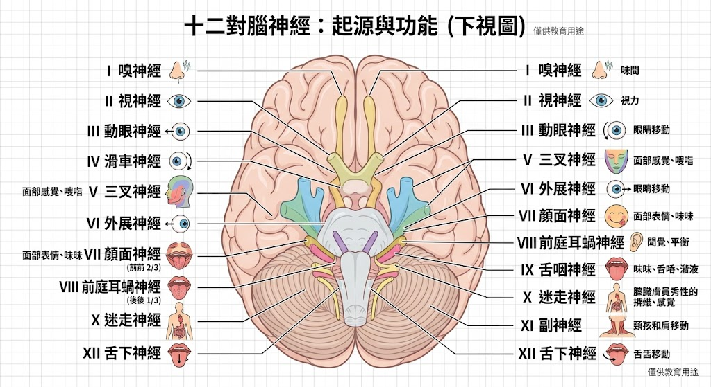
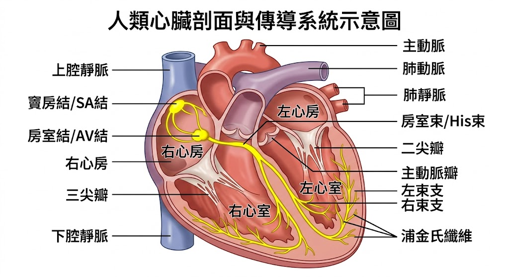
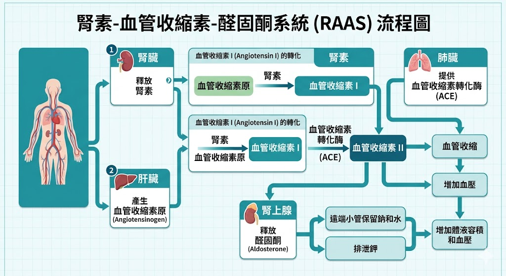

# 📖 護理師專技高考教材：基礎醫學－【解剖生理學】

**【考情分析】**
在考科一的 80 題中，解剖生理學佔了 40 題（解剖 20 題、生理 20 題），是基礎醫學拿分的關鍵。近五年的命題趨勢非常集中於**「神經系統（特別是腦神經）」、「內分泌（荷爾蒙回饋機制）」、「心血管（血流與傳導路徑）」以及「泌尿系統（RAAS機制）」**。解剖重位置，生理重機轉。

---

## 第一章：神經系統 (Nervous System)

神經系統是解剖學最愛考的章節，特別是十二對腦神經的配對與功能。

### 1.1 十二對腦神經 (Cranial Nerves) 🌟 (必考配對題)
口訣：一嗅、二視、三動眼；四滑、五叉、六外展；七顏、八聽、九舌咽；十迷、十一副、十二舌下。
* **純感覺神經：** I (嗅)、II (視)、VIII (聽/前庭耳蝸)。
* **純運動神經：** III (動眼)、IV (滑車)、VI (外展)、XI (副)、XII (舌下)。
* **混合神經 (含感覺與運動)：** V (三叉)、VII (顏面)、IX (舌咽)、X (迷走)。
* **【國考高頻考點】：**
  * **第三對 (動眼)：** 控制瞳孔收縮 (副交感)。瞳孔放大/縮小考題常客。
  * **第五對 (三叉)：** 臉部「感覺」、咀嚼肌「運動」。(角膜反射的傳入神經)。
  * **第七對 (顏面)：** 臉部表情肌「運動」、舌前 2/3「味覺」。(角膜反射的傳出神經)。貝爾氏麻痺 (Bell's palsy) 受損神經。
  * **第十對 (迷走)：** 分布最廣，管轄胸腹腔內臟的副交感神經。心跳減慢、腸胃蠕動增加。

### 1.2 自律神經系統 (ANS) 比較
* **交感神經 (Sympathetic)：** 「戰鬥或逃跑 (Fight or Flight)」。
  * 節前纖維短、節後纖維長。
  * 神經傳導物質：節前釋放 ACh (乙醯膽鹼)，節後釋放 NE (正腎上腺素)。
  * 生理反應：瞳孔放大、心跳加快、支氣管擴張、腸胃蠕動下降、血糖升高。
* **副交感神經 (Parasympathetic)：** 「休息與消化 (Rest and Digest)」。
  * 節前纖維長、節後纖維短。
  * 神經傳導物質：節前與節後皆釋放 ACh (乙醯膽鹼)。
  * 生理反應：瞳孔縮小、心跳減慢、支氣管收縮、腸胃蠕動增加。

> 📌 **[TODO 12: 腦神經分布與功能圖]**
> * **說明：** 繪製大腦底部的視角圖，標示出十二對腦神經的起源位置，並用簡單的 icon（如：眼睛、舌頭、心臟）表示其主要支配的器官。
> * 

---

## 第二章：內分泌系統 (Endocrine System)

生理學極度愛考荷爾蒙的「來源」與「拮抗作用」。

### 2.1 腦下垂體 (Pituitary Gland)
* **前葉 (腺性垂體)：** 分泌 6 種主要荷爾蒙 (由下視丘釋放激素控制)。
  * 生長激素 (GH)、泌乳素 (PRL)、促甲狀腺素 (TSH)、促腎上腺皮質素 (ACTH)、濾泡促進素 (FSH)、黃體生成素 (LH)。
* **後葉 (神經垂體)：** **不製造**荷爾蒙！只「儲存並釋放」下視丘製造的兩種荷爾蒙。
  1. **抗利尿激素 (ADH / Vasopressin)：** 促進腎臟集尿管對「水」的重吸收。缺乏會導致尿崩症。
  2. **催產素 (Oxytocin)：** 促進子宮收縮、促進乳汁「排出」(注意：乳汁「製造」是 PRL 的工作，這題極常混淆)。

### 2.2 鈣離子調節拮抗機制 🌟
* **副甲狀腺素 (PTH)：** 由副甲狀腺分泌。作用為 **「升血鈣」** (促進破骨細胞分解骨骼釋放鈣、增加腎臟回收鈣、活化維生素D以增加腸道吸收)。
* **降鈣素 (Calcitonin)：** 由甲狀腺的 C細胞 (濾泡旁細胞) 分泌。作用為 **「降血鈣」** (抑制破骨細胞，將血鈣存入骨骼)。

### 2.3 腎上腺 (Adrenal Gland)
* **皮質 (Cortex)：** (由外到內排列)
  * 球狀帶 ➔ 礦物性皮質素 (醛固酮 Aldosterone)：留鈉排鉀。
  * 束狀帶 ➔ 糖皮質素 (皮質醇 Cortisol)：壓力荷爾蒙，抗發炎、升血糖。
  * 網狀帶 ➔ 性激素 (雄性素 Androgen)。
* **髓質 (Medulla)：** 分泌腎上腺素 (Epi) 與 正腎上腺素 (NE)，受交感神經直接支配。

---

## 第三章：心血管系統 (Cardiovascular System)

### 3.1 心臟解剖與血流路徑
這是一定要能閉著眼睛畫出來的絕對路徑：
* **缺氧血路徑：** 上/下腔靜脈 ➔ **右心房** ➔ 三尖瓣 ➔ **右心室** ➔ 肺動脈瓣 ➔ 肺動脈 ➔ 肺部 (進行氣體交換)。
* **充氧血路徑：** 肺靜脈 ➔ **左心房** ➔ 二尖瓣 (僧帽瓣) ➔ **左心室** (心肌最厚的一層) ➔ 主動脈瓣 ➔ 主動脈 ➔ 全身。
* **冠狀動脈：** 提供心臟本身營養的血管，發源於「升主動脈」基部。

### 3.2 心臟傳導系統
控制心跳節律的特殊心肌細胞路徑：
1. **竇房結 (SA Node)：** 位於右心房。心臟的「天然節律點」，決定正常心跳 (60-100 次/分)。
2. **房室結 (AV Node)：** 位於心房中膈下部。負責「延遲」訊號，讓心房血液有時間排入心室。
3. **希氏束 (Bundle of His)：** 傳導至心室中膈。
4. **左右束支 (Bundle branches) ➔ 蒲金氏纖維 (Purkinje fibers)：** 傳播至整個心室，引發心室強力收縮。

> 📌 **[TODO 13: 心臟解剖與傳導系統示意圖]**
> * **說明：** 繪製心臟內部剖面圖，標示四個腔室與四個瓣膜，並用醒目的黃色線條與節點畫出 SA node ➔ AV node ➔ Bundle of His ➔ Purkinje fibers 的電氣傳導路徑。
> 

---

## 第四章：泌尿系統 (Urinary System)

### 4.1 腎元 (Nephron) 的結構與功能
腎元是腎臟的功能單位（每個腎臟約有 100 萬個），由「腎小體」與「腎小管」組成。
* **腎絲球 (Glomerulus)：** 負責「過濾」。大分子（如紅血球、大白蛋白）無法通過，若尿中出現代表絲球體受損。
* **近曲小管 (PCT)：** 最主要的「重吸收」場所！(吸收 100% 葡萄糖與胺基酸，約 65% 的水與鈉)。
* **亨利氏環 (Loop of Henle)：** 建立髓質高滲透壓。下行支通透「水」，上行支通透「鹽」。
* **遠曲小管 (DCT) 與 集尿管 (Collecting duct)：** 受荷爾蒙調控的區域。(受 Aldosterone 與 ADH 影響，決定尿液最終的濃縮程度)。

### 4.2 腎素-血管收縮素-醛固酮系統 (RAAS) 🌟 (五星級重中之重)
這是調節血壓與血容積最重要的生理機制，國考極愛考哪個酵素在哪裡分泌：
1. 當血壓下降或血鈉過低時，腎臟的近腎絲球細胞 (JG cells) 會分泌 **腎素 (Renin)**。
2. 肝臟平時會釋放 血管收縮素原 (Angiotensinogen)。腎素將其轉化為 **血管收縮素 I (Angiotensin I)**。
3. 血液流經肺臟時，肺部微血管表面的 **血管收縮素轉化酶 (ACE)** 會將其轉化為活性的 **血管收縮素 II (Angiotensin II)**。
4. **血管收縮素 II** 是強效的血管收縮劑，會直接讓血壓上升，並刺激腎上腺皮質分泌 **醛固酮 (Aldosterone)**。
5. 醛固酮作用於腎臟集尿管，促使「留鈉、留水、排鉀」，進一步使血壓與血容積上升。

> 📌 **[TODO 14: RAAS 機制流程圖]**
> * **說明：** 繪製 RAAS 系統的流程圖。需要有三個主要器官圖示（腎臟、肝臟、肺臟），標示出 Renin、Angiotensinogen、ACE 的作用節點，最後導向 Angiotensin II 與 Aldosterone 的血壓上升結果。
> * 