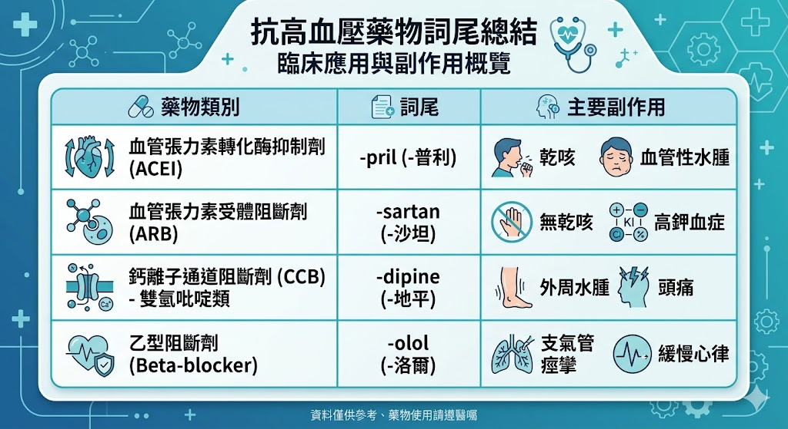
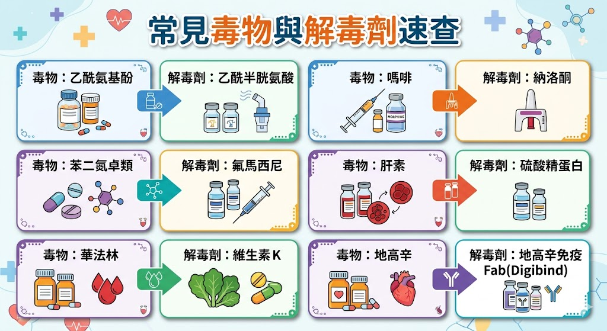

# 📖 護理師專技高考教材：基礎醫學－【藥理學】(Pharmacology)

**【考情分析】**
藥理學在國考中約佔 20 題。千萬不要漫無目的地背藥典！拿分的黃金法則是掌握：(1) 心血管用藥的「字尾分類」，(2) 抗生素的「特定器官毒性」，(3) 常見藥物過量的「專屬解毒劑」。

---

## 第一章：自律神經系統用藥

本章重點在於辨識藥物的作用機轉，特別是「阿托品 (Atropine)」與「交感神經阻斷劑」。

### 1.1 膽鹼激性與抗膽鹼藥物
* **擬膽鹼藥物 (Cholinergic)：** 作用類似副交感神經。
  * **Bethanechol：** 促進平滑肌收縮，用於治療**尿尿困難（尿瀦留）**及手術後腸麻痺。
  * **Neostigmine：** 用於治療**重症肌無力 (MG)**。
* **抗膽鹼藥物 (Anticholinergic)：** 🌟 (國考常客)
  * **Atropine (阿托品)：** 阻斷副交感神經。
  * **臨床用途：** 手術前給藥（減少呼吸道分泌物）、治療心跳過緩 (Bradycardia)、有機磷中毒的解毒劑、散瞳劑。
  * **副作用：** 口乾、視力模糊、便秘、尿瀦留（青光眼與攝護腺肥大患者**禁用**）。

### 1.2 交感神經阻斷劑 (Beta-blockers)
* **字尾辨識：** **`-olol`** (如 Propranolol, Atenolol)。
* **作用機轉：** 降低心跳速率與心肌收縮力，用於治療高血壓、心絞痛、心律不整。
* **致命陷阱題：** 非選擇性 Beta-blocker (如 Propranolol) 會同時阻斷支氣管的 β2 受體導致支氣管收縮，因此**氣喘 (Asthma) 及 COPD 患者絕對禁用**。

---

## 第二章：心血管系統用藥 🌟 (超級考區)

心血管用藥是藥理學的命脈，請務必熟記以下三大類高血壓藥物的字尾。

### 2.1 抗高血壓藥物字尾速記法
1. **血管收縮素轉化酶抑制劑 (ACEI)：**
   * **字尾：** **`-pril`** (如 Captopril, Enalapril)。
   * **必考副作用：** **乾咳 (Dry cough)**（常導致病人停藥的主因）、高血鉀。
2. **血管收縮素受體阻斷劑 (ARB)：**
   * **字尾：** **`-sartan`** (如 Valsartan, Losartan)。
   * **特點：** 作用與 ACEI 相似，但**不會引起乾咳**，常作為 ACEI 替代藥物。
3. **鈣離子通道阻斷劑 (CCB)：**
   * **字尾：** **`-dipine`** (如 Amlodipine, Nifedipine)。
   * **必考副作用：** 周邊水腫、姿勢性低血壓、臉部潮紅。

### 2.2 心臟衰竭用藥：毛地黃 (Digoxin)
* **作用機轉：** 增加心肌收縮力（正性肌力），減慢心跳（負性心率）。
* **給藥前評估：** 必須測量心尖脈 1 分鐘，成人心跳 **< 60 次/分** 需停藥。
* **毛地黃中毒 (Digoxin Toxicity)：** 🌟
  * **誘發因素：** **低血鉀 (Hypokalemia)** 會增加毛地黃毒性（常因併用排鉀利尿劑引起）。
  * **中毒症狀：** 腸胃道（厭食、噁心、嘔吐為最早期症狀）、視覺異常（黃綠色暈輪、視力模糊）、心律不整。
  * **解毒劑：** Digoxin immune Fab (Digibind)。

### 2.3 心絞痛用藥：硝酸甘油 (Nitroglycerin, NTG)
* **給藥途徑：** 舌下含服 (SL) 吸收最快，避開肝臟首過效應。
* **護理指導：** 
  * 放在原裝**棕色避光玻璃瓶**內，保持乾燥。
  * 若胸痛發作，每 5 分鐘含一顆，最多含 **3 顆**。若仍未緩解需立即就醫。
  * 常見副作用：血管擴張導致的**搏動性頭痛**、姿勢性低血壓（教導病人坐著或躺著含藥）。

> 📌 **[TODO 15: 心血管字尾與副作用對應表]**
> * **說明：** 建立一個表格 infographic，列出 ACEI (-pril)、ARB (-sartan)、CCB (-dipine)、Beta-blocker (-olol) 的藥物名稱字尾、主要副作用與使用禁忌。
> * 

---

## 第三章：中樞神經系統用藥

### 3.1 鎮靜安眠藥
* **苯二氮平類 (Benzodiazepines, BZD)：**
  * **字尾：** **`-pam` 或 `-lam`** (如 Diazepam, Midazolam)。
  * **特點：** 比傳統巴比妥鹽安全，用於抗焦慮、安眠、肌肉鬆弛、抗癲癇。
  * **專屬解毒劑：** **Flumazenil** (🌟 必背)。

### 3.2 鎮痛劑與麻醉性止痛藥
* **非類固醇消炎止痛藥 (NSAIDs)：** 如 Aspirin, Ibuprofen。
  * 副作用：腸胃潰瘍/出血（飯後服用）、抑制血小板凝集。
* **乙醯胺酚 (Acetaminophen / 普拿疼)：**
  * 特點：解熱鎮痛，但**無**抗發炎作用。不傷胃。
  * 過量毒性：**肝毒性**。
  * **專屬解毒劑：** **Acetylcysteine (NAC)**。
* **鴉片類止痛藥 (Opioids)：** 如 Morphine (嗎啡), Fentanyl。
  * 致命副作用：**呼吸抑制**（給藥前呼吸 < 12次/分 需停藥）、針狀瞳孔 (Pinpoint pupils)。
  * 其他副作用：便秘、尿瀦留。
  * **專屬解毒劑：** **Naloxone (Narcan)**。

---

## 第四章：抗感染與抗結核藥物

此單元不考複雜的抗菌頻譜，只考「特定副作用」的配對。

### 4.1 抗細菌藥物 (Antibiotics)
* **盤尼西林類 (Penicillins)：** 最常引起過敏性休克 (Anaphylaxis)。給藥前需做皮膚過敏試驗 (PST)。
* **胺基醣苷類 (Aminoglycosides)：** (如 Gentamicin)。
  * **兩大毒性：** **耳毒性** (聽力受損、耳鳴)、**腎毒性** (BUN/Cr 升高)。
* **四環黴素 (Tetracyclines)：**
  * **護理指導：** 會與鈣離子結合，**不可與牛奶、制酸劑併服**。會造成牙齒永久性黃褐色染色，孕婦及 8 歲以下兒童禁用。

### 4.2 抗結核病藥物 (Anti-TB Drugs) 🌟 (第一線用藥必背)
結核病通常採合併療法以防抗藥性。
1. **Isoniazid (INH)：** 
   * 副作用：周邊神經炎、肝毒性。
   * 預防方法：必須常規補充 **維生素 B6 (Pyridoxine)**。
2. **Rifampin (RIF)：**
   * 副作用：肝毒性。會使尿液、汗水、眼淚變成**橘紅色**（這是正常現象，需事先衛教病人，勿恐慌）。
3. **Ethambutol (EMB)：**
   * 副作用：**視神經炎**（導致視力模糊、紅綠色盲）。需定期檢查視力。

---

## 第五章：國考必備「特效解毒劑」總表 🌟🌟🌟
這是考前 10 分鐘必看的搶分表。只要出現中毒情境，找這些配對就對了！

| 毒物 / 過量藥物 (Toxin/Drug) | 特效解毒劑 (Antidote) |
| :--- | :--- |
| **Acetaminophen (普拿疼)** | **Acetylcysteine (NAC)** |
| **鴉片類 / 嗎啡 (Morphine)** | **Naloxone (Narcan)** |
| **BZD 類安眠藥 (如 Diazepam)**| **Flumazenil** |
| **毛地黃 (Digoxin)** | Digoxin immune Fab (Digibind) |
| **肝素 (Heparin)** | **Protamine sulfate (魚精蛋白)** |
| **華法林 (Warfarin / Coumadin)**| **Vitamin K** |
| **有機磷 / 殺蟲劑** | **Atropine** + Pralidoxime (PAM) |
| **鐵劑 (Iron) 過量** | Deferoxamine |
| **重金屬 (鉛、汞) 中毒** | BAL, EDTA, Penicillamine |

> 📌 **[TODO 16: 毒物與解毒劑記憶圖卡]**
> * **說明：** 製作一組 6 張的記憶圖卡 (Flashcards graphic)，左側是毒物圖示（如藥丸、針筒、老鼠藥），右側是對應的解毒劑名稱。
> * 