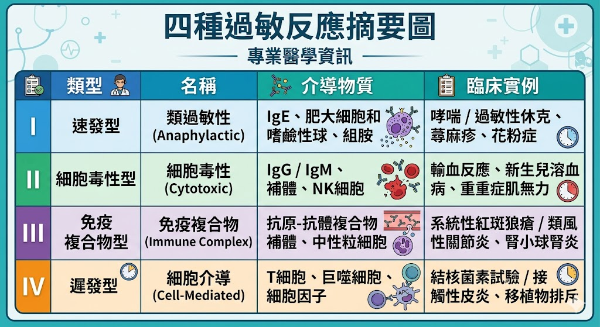

# 📖 護理師專技高考教材：基礎醫學－【微生物及免疫學】

**【考情分析】**
微生物與免疫學在基礎醫學中約佔 10~12 題。這科的投資報酬率極高，因為考點非常固定。**「過敏反應分型 (Type I~IV)」** 是年年必考的絕對重點；其次是**「免疫球蛋白 (Ig) 的特性」**與**「常見傳染病的病原體與傳播途徑」**。

---

## 第一章：免疫學核心概念

### 1.1 免疫球蛋白 (Immunoglobulins, Ig) 特性比較 🌟 (必考配對)
人體有五大類抗體，簡稱 **GAMED**，請務必熟記其獨特功能：
* **IgG：** 血液中**含量最多** (佔 75-80%)。唯一能**通過胎盤**的抗體（提供新生兒自然被動免疫）。代表「曾經感染」或「慢性感染」。
* **IgA：** 主要存在於**分泌物**中（如：初乳、唾液、眼淚、呼吸道黏膜）。保護黏膜免受感染。
* **IgM：** 體積最大（五聚體）。是初次感染時**最先產生**的抗體，代表「近期/急性感染」。
* **IgE：** 含量極少。參與 **第一型過敏反應 (Type I)** 及 **寄生蟲感染**。
* **IgD：** 存在於 B 細胞表面，作為抗原接受器，參與 B 細胞的活化。

### 1.2 四大過敏反應 (Hypersensitivity) 🌟🌟🌟 (五星級重中之重)
國考最愛考疾病屬於哪一型過敏反應：
* **第一型 (立即型 / 凝集型，Type I)：** 
  * 媒介：**IgE** 與 肥大細胞 (Mast cell) 釋放組織胺。
  * 特徵：接觸過敏原後數分鐘內發作。
  * 常見疾病：**過敏性休克 (Anaphylaxis)**、氣喘、異位性皮膚炎、花粉症、食物過敏。
* **第二型 (細胞毒性型，Type II)：**
  * 媒介：**IgG 或 IgM** 直接攻擊細胞表面的抗原，導致細胞破裂。
  * 常見疾病：**輸血反應 (ABO血型不合)**、新生兒溶血症、重症肌無力 (MG)、風濕熱。
* **第三型 (免疫複合體型，Type III)：**
  * 媒介：抗原與抗體 (IgG/IgM) 結合成「免疫複合體」，沈積在血管壁或組織引起發炎。
  * 常見疾病：**全身性紅斑性狼瘡 (SLE)**、類風濕性關節炎 (RA)、急性鏈球菌感染後腎絲球腎炎 (APSGN)、血清病。
* **第四型 (遲發型 / 細胞媒介型，Type IV)：**
  * 媒介：**與抗體無關！** 由 **T細胞** 媒介。
  * 特徵：反應較慢，通常在接觸後 48~72 小時才發生。
  * 常見疾病：**結核菌素測驗 (PPD test)**、器官移植排斥、接觸性皮炎 (如漆樹毒、金屬飾品過敏)。

> 📌 **[TODO 17: 四大過敏反應機制與疾病對應表]**
> * **說明：** 建立一個對比表格 infographic，列出 Type I 到 Type IV 的名稱、主要媒介（IgE, IgG/IgM, Immune complex, T-cells）以及代表性疾病。
> * 

---

## 第二章：重要微生物與傳染病

### 2.1 細菌染色與細胞壁
* **革蘭氏陽性菌 (Gram-positive, G+)：** 染成**紫色**。細胞壁有厚厚的**肽聚醣 (Peptidoglycan)**。
* **革蘭氏陰性菌 (Gram-negative, G-)：** 染成**紅色/粉紅色**。細胞壁有一層外膜，含有**脂多醣 (LPS / 內毒素 Endotoxin)**，是引發敗血性休克的元兇。

### 2.2 常見致病菌與特徵
* **金黃色葡萄球菌 (S. aureus)：** 引起傷口感染、食物中毒（腸毒素耐熱）、毒性休克症候群 (TSS)。
* **A 族化膿性鏈球菌 (S. pyogenes)：** 引起咽喉炎。若未治癒，後續易引發自體免疫疾病（風濕熱、腎絲球腎炎）。
* **梅毒螺旋體 (Treponema pallidum)：** 
  * 第一期：無痛性硬性下疳。
  * 第二期：全身性扁平濕疣、梅毒疹（手掌腳底）。
  * 第三期：樹膠腫、神經梅毒。
* **結核分枝桿菌 (Mycobacterium tuberculosis)：** 抗酸性染色 (Acid-fast stain) 呈陽性。細胞壁富含脂質（分枝菌酸），抵抗力強。

### 2.3 病毒性肝炎傳播途徑
* **糞口傳染 (吃進去的)：** **A 型** (HAV)、**E 型** (HEV)。
* **血液/體液傳染 (打針、輸血、性行為)：** **B 型** (HBV)、**C 型** (HCV，最易轉為慢性肝硬化/肝癌)、**D 型** (HDV，必須伴隨B肝才能感染)。

---

