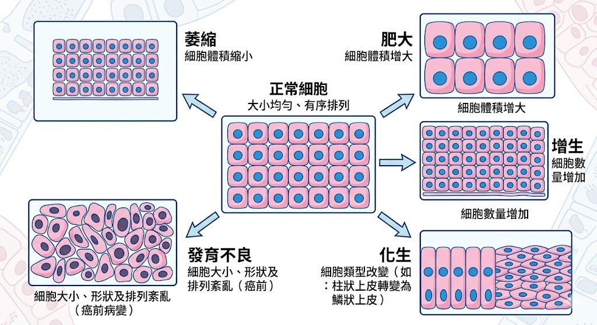

# 📖 護理師專技高考教材：基礎醫學－【病理學】

**【考情分析】**
病理學約佔 10 題。重點在於「細胞適應的專有名詞定義」、「發炎反應的細胞變化」以及「良性與惡性腫瘤的命名規則」。這科通常不難，掌握名詞定義即可拿分。

---

## 第一章：細胞損傷與適應

當細胞面臨壓力時，會改變自身形態來適應，這些專有名詞是必考題。
* **萎縮 (Atrophy)：** 細胞**體積縮小**。（如：打石膏後的肌肉萎縮）。
* **肥大 (Hypertrophy)：** 細胞**體積增大**。（如：重訓後的骨骼肌變大、高血壓導致的左心室肥大）。
* **增生 (Hyperplasia)：** 細胞**數目增加**。（如：長期摩擦導致長繭、攝護腺肥大 BPH、子宮內膜增生）。
* **化生 (Metaplasia)：** 一種成熟細胞**轉變成另一種**成熟細胞，以適應惡劣環境。（如：抽菸者的氣管纖毛柱狀上皮，轉變成耐磨的鱗狀上皮；胃食道逆流的巴瑞特氏食道 Barrett's esophagus）。
* **發育異常 / 變異 (Dysplasia)：** 細胞大小、形狀與排列變得不規則。是**癌症的前兆**（癌前病變），但若移除刺激仍可恢復。（如：子宮頸抹片檢查出的 CIN）。

> 📌 **[TODO 18: 細胞適應類型圖解]**
> * **說明：** 繪製一組簡單的細胞排列圖。最左側為正常細胞（Normal），向右分支展現：Atrophy (變小)、Hypertrophy (變大)、Hyperplasia (變多)、Metaplasia (變形狀)、Dysplasia (大小不一且混亂)。
> * 

---

## 第二章：發炎與修復 (Inflammation & Repair)

* **急性發炎的四大典型症狀 (Celsus signs)：**
  * **紅 (Rubor)：** 血管擴張，血流增加。
  * **熱 (Calor)：** 血流增加，帶來體溫。
  * **腫 (Tumor)：** 微血管通透性增加，血漿外滲到組織。
  * **痛 (Dolor)：** 發炎物質（如：前列腺素 Prostaglandins、緩激肽 Bradykinin）刺激神經末梢。
* **發炎細胞主角：**
  * **嗜中性白血球 (Neutrophils)：** **急性發炎**最先抵達現場的主力，負責吞噬細菌，死後形成膿液。
  * **巨噬細胞 (Macrophages) & 淋巴球 (Lymphocytes)：** **慢性發炎**的主角。
  * **嗜酸性白血球 (Eosinophils)：** 參與**寄生蟲感染**與**過敏反應**。

---

## 第三章：腫瘤病理學 (Neoplasia)

良性與惡性腫瘤的「字尾命名規則」與「轉移方式」是常考焦點。

### 3.1 良性 vs. 惡性腫瘤
* **良性腫瘤 (Benign)：** 生長緩慢、有包膜、不轉移、外觀分化良好（像正常細胞）、字尾通常直接加 **`-oma` (瘤)**。如：Lipoma (脂肪瘤)、Adenoma (腺瘤)。
* **惡性腫瘤 (Malignant / Cancer)：** 生長快速、無包膜會侵入周圍組織、**會轉移 (Metastasis)**、分化不良、有異常有絲分裂。

### 3.2 惡性腫瘤命名規則 🌟
* **癌 (Carcinoma)：** 源自**上皮組織**的惡性腫瘤。是最常見的癌症類型。
  * 經由 **淋巴系統 (Lymphatics)** 轉移為主。
  * 如：鱗狀細胞癌、腺癌。
* **肉瘤 (Sarcoma)：** 源自**間質/結締組織**（骨骼、肌肉、脂肪、血管）的惡性腫瘤。
  * 經由 **血流系統 (Hematogenous)** 轉移為主。
  * 如：骨肉瘤 (Osteosarcoma)、脂肪肉瘤。

### 3.3 命名的例外陷阱 🌟 (必背例外)
以下這些字尾雖然是 `-oma`，但它們是**絕對的惡性腫瘤**：
1. **淋巴瘤 (Lymphoma)：** 惡性。
2. **黑色素瘤 (Melanoma)：** 惡性。
3. **肝癌 / 肝細胞瘤 (Hepatoma)：** 惡性。
4. **精原細胞瘤 (Seminoma)：** 睾丸的惡性腫瘤。